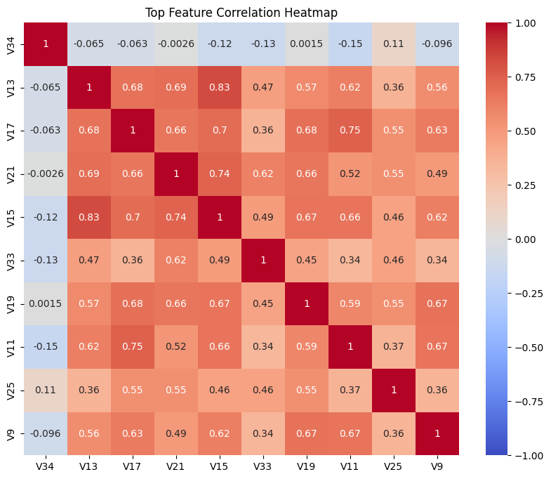
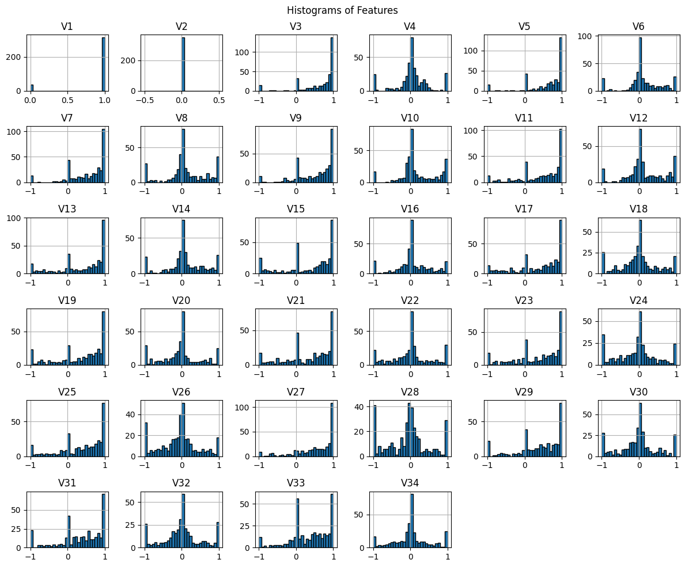
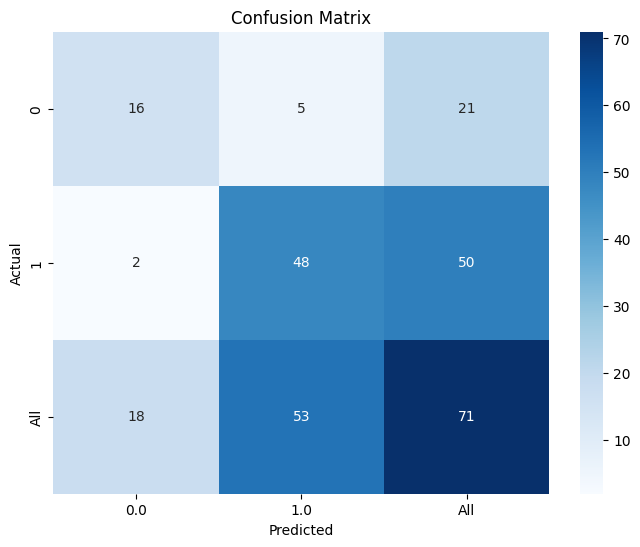
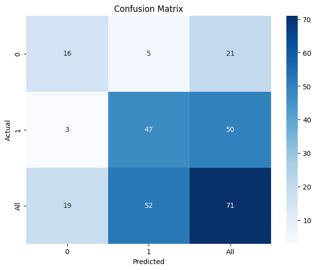
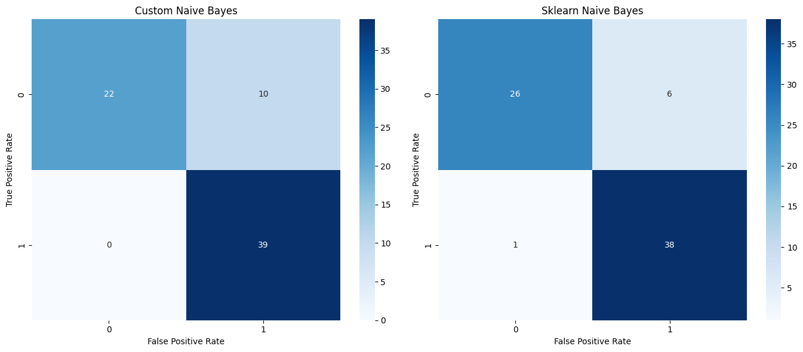

# ML Assignment - Naive Bayes Binary Classification on Ionosphere Dataset

## Problem Statement

We are tasked with implementing a binary classification module using the Ionosphere dataset. The goal is to classify the data points as either `good` or `bad`, based on radar signals, and compare two implementations: one from scratch and the other using Sklearn.

## Group Members

- Satish Jhanwer (G24AIT009)
- Aditya Sharma (G24AIT011)
- Jyothsna Sravanthi (G24AIT015)

## Dataset Overview

The dataset contains features obtained from radar signals. Each signal is labeled either `good` `(presence of an object)` or `bad` `(empty air)`. We will split the dataset into an `80:20` ratio for training and testing.

### Data Representation

## Approach

### Naive Bayes from Scratch

We implemented a Gaussian Naive Bayes classifier from scratch using the following steps:

- **Calculate Mean and Variance**: For each class `(good/bad)`, calculate the mean and variance for each feature.
- **Probability Calculation**: Compute the class-conditional probabilities using `Gaussian Probability Density`.
- **Posterior Calculation**: Use Bayes Theorem to compute posterior probabilities for each class and make a prediction based on the highest probability.
- **Evaluation**: Measure accuracy, precision, recall, and F1 score.

### Naive Bayes Using Sklearn

We also used the GaussianNB classifier from the Sklearn library for comparison:

- **Model Training**: Trained the model using the training data split.
- **Evaluation**: Predicted on test data and calculated performance metrics.

## Evaluation Metrics

The following metrics were used for performance evaluation:

- **Accuracy**: The percentage of correctly classified instances.
- **Precision**: The percentage of correct positive predictions.
- **Recall**: The percentage of actual positives correctly classified.
- **F1 Score**: The harmonic mean of precision and recall.
- **Confusion Matrix**: A matrix to visualize misclassifications.

## Results

### Result from Scratch Implementation

|              | Precision | Recall   | F1 Score | Support  |
| ------------ | --------- | -------- | -------- | -------- |
| 0            | 1.000000  | 0.642857 | 0.782609 | 28.00000 |
| 1            | 0.811321  | 1.000000 | 0.895833 | 43.00000 |
| Accuracy     | 0.859155  | 0.859155 | 0.859155 | 0.859155 |
| Macro Avg    | 0.905660  | 0.821429 | 0.839221 | 71.00000 |
| Weighted Avg | 0.885729  | 0.859155 | 0.851181 | 71.00000 |

### Result from Sklearn Implementation

|              | Precision | Recall   | F1 Score | Support  |
| ------------ | --------- | -------- | -------- | -------- |
| 0            | 0.913043  | 0.750000 | 0.823529 | 28.00000 |
| 1            | 0.854167  | 0.953488 | 0.901099 | 43.00000 |
| accuracy     | 0.873239  | 0.873239 | 0.873239 | 0.873239 |
| macro avg    | 0.883605  | 0.851744 | 0.862314 | 71.00000 |
| weighted avg | 0.877386  | 0.873239 | 0.870508 | 71.00000 |

## Time Comparison

- **Time for Naive Bayes from Scratch**: `0.011476 seconds`
- **Time for Sklearn Naive Bayes**: `0.002260 seconds`

## Conclusion

The Sklearn implementation is faster and more accurate, benefiting from optimized underlying libraries. However, our custom implementation gives insight into how Naive Bayes works at the foundational level.
